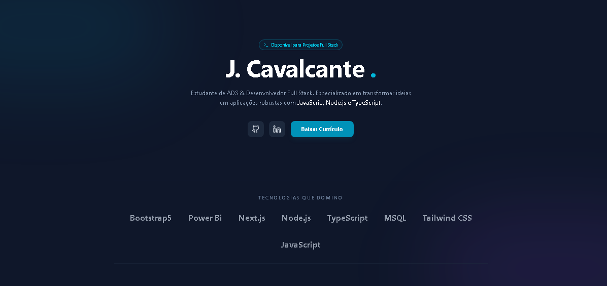

# 🌐 Portfólio — Jerry Cavalcante

Meu portfólio profissional como **Desenvolvedor Full-Stack**: uma vitrine dos projetos que construí e coloquei em produção, com foco em aplicações web reais — de SaaS com pagamento a automações de WhatsApp.

🔗 **Acesse ao vivo:** https://portf-lio-xi-ruddy.vercel.app



---

## 👋 Sobre mim

Desenvolvedor Full-Stack e estudante de Análise e Desenvolvimento de Sistemas. Gosto de transformar problemas reais em produtos que funcionam e vão pro ar — não só protótipos. Tenho perfil resolvedor: construo do banco de dados ao deploy.

## 🚀 Projetos em destaque

| Projeto | Descrição | Demo |
|---------|-----------|------|
| **Chaveiro Pro (SaaS)** | SaaS de gestão para chaveiros: login social, multi-cliente, estoque, vendas e cobrança recorrente com Stripe | [ver](https://chaveiro-saas.vercel.app) |
| **Chaveiro Pro (demo)** | Painel de gestão de produtos, estoque e margens (front-end) | [ver](https://cheveiro-gestao.vercel.app) |
| **Barbearia Jé** | Site institucional responsivo com agendamento via WhatsApp | [ver](https://barbearia-je.vercel.app) |
| **Bot WhatsApp** | Automação de atendimento com menu interativo (WPPConnect) | — |

## 🛠️ Tecnologias

- **Front-end:** Next.js, React, TypeScript, Tailwind CSS, HTML, CSS, JavaScript
- **Back-end:** Node.js, Next.js API Routes, PHP
- **Banco de dados:** PostgreSQL, Prisma, MySQL, SQL
- **Autenticação & Pagamentos:** NextAuth, Clerk, Stripe
- **Dados:** Power BI, Excel
- **Deploy:** Vercel

## 📫 Contato

- 🐙 GitHub: [@jcavalcante88](https://github.com/jcavalcante88)
- 💼 LinkedIn: [jerry-camargo](https://www.linkedin.com/in/jerry-camargo)
- 🌐 Portfólio: [portf-lio-xi-ruddy.vercel.app](https://portf-lio-xi-ruddy.vercel.app)

## 💻 Rodar localmente

```bash
git clone https://github.com/jcavalcante88/Portf-lio-.git
cd Portf-lio-
npm install
npm run dev
```

Construído com **Next.js + TypeScript + Tailwind CSS**.
